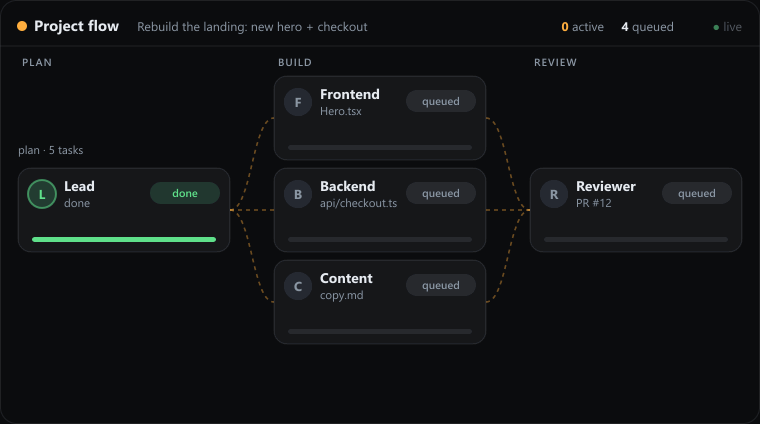

  

  
  
  
  
  

  <b>Describe what you want. A team of AI agents builds it — and you watch it happen, live.</b> 
  Games, websites, apps and design — multiple specialists working together on your project.

  <a href="https://github.com/yHysoka/OrbSync-App/releases/latest/download/OrbSync-v1-Setup.exe"><b>⬇️ Download for Windows</b></a>
  &nbsp;·&nbsp;
  <a href="https://orbsync.com.br">🌐 Website</a>
  &nbsp;·&nbsp;
  <a href="#-how-it-works">How it works</a>
  &nbsp;·&nbsp;
  <a href="#-features">Features</a>

  
   <i>The live Flow — your agents working in parallel, in real time.</i>

---

## Why OrbSync

Working with a single AI assistant means babysitting it: ask, copy, paste, test, repeat. **OrbSync gives you a team instead.**

You describe a goal once. A **Lead** breaks it into tasks and hands each to the right specialist — frontend, backend, design, QA. They work **in parallel**, pass results to one another, and you watch the whole thing happen on a **live canvas**. When it's done, you review and integrate. It's your project, built by a team, at your pace.

## 🔭 How it works

1. **You describe** what you want to build (or fix).
2. The **Lead** breaks it into tasks with dependencies and assigns each to the right agent.
3. Agents **work in parallel**, passing results to one another (handoff).
4. You follow along in the **live Flow** — who's doing what, in which file, at which stage.
5. You **review and integrate**. Something broke? Just say what's wrong — it diagnoses the cause, **fixes it**, and tells you **what the solution was**.

## ✨ Features

| | |
|---|---|
| 🧠 **Lead + agents** | Breaks your goal into a plan and routes tasks to specialists that run in parallel. |
| 🔀 **Live Flow** | A real-time canvas of your agents working — step by step. |
| 🎮 **Modes** | Game, Website and Design — AI-guided generation with an options panel. |
| 👁️ **Preview** | See what's being built without leaving the app. |
| 🧩 **Flow templates** | Ready-made recipes (landing page, app, game…) so you start without describing everything. |
| 💸 **Cost & ROI** | See your spend per provider and how much OrbSync saved you. |
| 🧠 **Memory** | Long-term project memory — it remembers context across sessions. |
| 🔌 **Multi-provider** | Works with Claude and other providers; mark a provider as a subscription so it doesn't count against your credit. |
| 🔁 **Auto-update** | New versions arrive automatically. |

## 🚀 Get started

1. **[Download the Windows installer](https://github.com/yHysoka/OrbSync-App/releases/latest/download/OrbSync-v1-Setup.exe)** (`OrbSync-v1-Setup.exe`).
2. Install and open — it takes under a minute.
3. Start with a **free trial**; then **Sync** keeps the agents working. Details at **[orbsync.com.br](https://orbsync.com.br)**.

> 💡 On first launch, Windows may show an "unrecognized app" warning (new installer). Just click **More info → Run anyway**.

## 🖼️ Screenshots

<!-- Tip: replace these placeholders with real screenshots (Chat, Projects/Kanban, Cost). -->

| Chat & Lead | Projects (Kanban) |
|:---:|:---:|
| _(add a screenshot)_ | _(add a screenshot)_ |

| Live Flow | Cost & ROI |
|:---:|:---:|
| _(add a screenshot)_ | _(add a screenshot)_ |

## 🗺️ Roadmap

- [x] Live agent Flow
- [x] Flow templates
- [x] Per-provider cost panel + ROI
- [ ] More modes and templates
- [ ] Code signing (install with no warnings)
- [ ] _Your idea here_ — open an **[Issue](https://github.com/yHysoka/OrbSync-App/issues)** with suggestions and bugs.

## 💬 Feedback

Found a bug or have an idea? Open an **[Issue](https://github.com/yHysoka/OrbSync-App/issues)**. Like the project? Drop a ⭐ — it genuinely helps more people discover it.

---

OrbSync is a proprietary product. This repository hosts the **installers** and **public documentation** — the source code is not open. © OrbSync.
